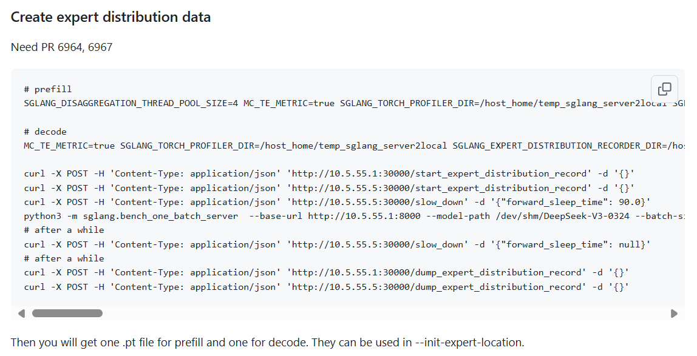

## sglang 复现指南
## 复现脚本
下面是你可能用得到的脚本，你可能需要修改某些配置
* run_prefill.sh/run_decode.sh：启动相应P/D instance
```bash
srun -N x -n x --gres=gpu:8 --cpus-per-task=32 ./run_prefill.sh
```
* run_lb.sh：启动load balancer
```bash
./run_lb.sh
```
* benchmark.sh：profile相应instance
```
./benchmark.sh [mode] [profile]
```
第一个参数为prefill/decode，第二个参数为true/false
* run_deep_ep.sh
```bash
srun -N x -n x --gres=gpu:8 --cpus-per-task=32 ./run_deep_ep.sh [mode]
```
mode为intranode/internode/low_latency
* ib_monitor.py 
检测网卡带宽
* test_mooncake.sh
测试mooncake
### sglang 安装
官方复现instruction https://github.com/sgl-project/sglang/issues/6017
```bash
git clone git@github.com:tianr22/SGLang-reproduce.git
cd sglang
pip install --upgrade pip
pip install -e "python[all]"
```
* 需另安装deepep与mooncake，mooncake安装lastest version，deepep最新版本可能存在性能问题（TODO，在新集群上比较最新分支与commit id 9d4f7ef8eeedd9970c2bb8efe998e07e7bb9df5b的性能差距）
### sglang prefill 复现
* 脚本参考run_prefill.sh
* 脚本有关的另外的注意点
  * prefill需要传参数--deepep-config YOUR_PATH为tune过后的deepep配置，详见https://github.com/sgl-project/sglang/pull/6742
  * --init-expert-location YOUR_PATH sglang官方针对某些输入给了现成分布，详见仓库中的attachment_ep_statistics
    * 如果想要自己生成配置可参考
    
  * 设置环境变量SGLANG_DISAGGREGATION_BOOTSTRAP_TIMEOUT可以延长bootstrap时间
* 复现流程：
  * 启动prefill结点，启动decode结点，启动load balancer，启动benchmark脚本
### sglang decode 复现
* 脚本参考run_decode.sh
* 脚本有关的另外的注意点
  * --init-expert-location YOUR_PATH
  * export SGLANG_DEEPEP_NUM_MAX_DISPATCH_TOKENS_PER_RANK=256如果cuda-graph-bs为256
  * 设置环境变量SGLANG_DISAGGREGATION_WAITING_TIMEOUT可以延长bootstrap时间
  * 在高并发下（benchmark的bs很大），可能需要增大timeout时延(修改sglang中mooncake/conn.py)
* 复现流程：
  * 对于decode阶段的测试，需要尽量打满cuda_graph_bs
  * 启动prefill结点，启动decode结点，启动load balancer，sleep decode结点，启动benchmark脚本，打满batch后取消sleep
